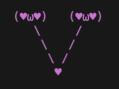

# yaoiprint

A terminal CLI that prints a randomly selected ASCII art image in a random color.

## Example



## Usage

Print a random image:

```sh
cargo run
```

Print a specific image by index:

```sh
cargo run -- 3
```

If the provided index exceeds the number of available images, it wraps around automatically.

## How It Works

A build script (`build.rs`) reads the `src/images` file at compile time, splits entries on `newline` delimiters, and generates a static `IMAGES` array embedded into the binary. At runtime, the program picks an entry — either randomly or by the index argument — and renders it in one of 12 terminal colors via the `colour` crate.

## Building

Requires Rust (edition 2024).

```sh
cargo build --release
```

The compiled binary is at `target/release/yaoi-rs`.

## Adding Images

Open `src/images` and append a new ASCII art block, separated from the previous entry by a line containing only `newline`. Rebuild to include it.

## Dependencies

| Crate   | Purpose                        |
|---------|--------------------------------|
| `rand`  | Random index and color selection |
| `colour`| Colored terminal output        |

## License

MIT License

Copyright (c) 2026

Permission is hereby granted, free of charge, to any person obtaining a copy
of this software and associated documentation files (the "Software"), to deal
in the Software without restriction, including without limitation the rights
to use, copy, modify, merge, publish, distribute, sublicense, and/or sell
copies of the Software, and to permit persons to whom the Software is
furnished to do so, subject to the following conditions:

The above copyright notice and this permission notice shall be included in all
copies or substantial portions of the Software.

THE SOFTWARE IS PROVIDED "AS IS", WITHOUT WARRANTY OF ANY KIND, EXPRESS OR
IMPLIED, INCLUDING BUT NOT LIMITED TO THE WARRANTIES OF MERCHANTABILITY,
FITNESS FOR A PARTICULAR PURPOSE AND NONINFRINGEMENT. IN NO EVENT SHALL THE
AUTHORS OR COPYRIGHT HOLDERS BE LIABLE FOR ANY CLAIM, DAMAGES OR OTHER
LIABILITY, WHETHER IN AN ACTION OF CONTRACT, TORT OR OTHERWISE, ARISING FROM,
OUT OF OR IN CONNECTION WITH THE SOFTWARE OR THE USE OR OTHER DEALINGS IN THE
SOFTWARE.
